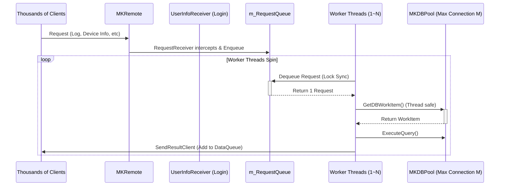

# [gstack] /plan-eng-review: RACTServer 병목 최적화 아키텍처

> **역할**: Eng Manager
> **주요 목표**: 아키텍처 아웃라인 확정, 데이터 흐름 명확화, 엣지 케이스/동시성 해저드 방어, 구체적인 테스트 플랜 수립.

## 1. 아키텍처 결정 (Architecture Lock-in)

초기 제안된 `ThreadPool.QueueUserWorkItem` 방식은 단순하지만, 제어되지 않은 다수의 동시 요청이 DB Connection Pool(현재 size: `GlobalClass.m_SystemInfo.DBConnectionCount`)을 단숨에 고갈시켜 `NullReferenceException`이나 `DBProcessError`를 발생시킬 치명적인 **Edge Case**를 가집니다. 

따라서 **Fixed Worker Thread Array (고정 워커 스레드 배열)** 방식을 채택합니다.
- 이벤트 루프 로직(`ProcessClientRequest`) 자체는 수정하지 않고 그대로 유지합니다(Surgical Change).
- 단일 `Thread` 객체 생성부를 `Thread[]` 배열로 변경하여 DB Connection Pool의 여유를 넘지 않는 개수(예: `DBConnectionCount - 2` 혹은 최대 N개)만큼의 스레드가 큐를 분할 처리하도록 합니다.
- 스레드는 이미 `lock (m_RequestQueue)`로 동기화 처리되어 있으므로 추가적인 락 컨트롤 설계 변경 없이 안전하게 병렬 처리율을 끌어올릴 수 있습니다.

### 데이터 흐름 다이어그램 (Data Flow)

## 2. 작업 상세 대상 (Proposed Changes)

요청을 받아 분배하는 ClientCommunicationProcess와, 이어진 후속 요청을 처리하는 ClientResponseProcess 2곳이 수정 대상입니다.

### RACTServer
#### [MODIFY] `d:\dev\skbb\tact-origin-refac\tact-origin\RACTServer\RACTServer\ClientCommunicationProcess.cs`
- `private Thread m_RequestProcessThread = null;` 를 `private Thread[] m_RequestProcessThreads = null;` 배열로 변경.
- `Start()` 내의 초기화 루틴에서, 시스템 가용 DB커넥션 수치(또는 고정값 예: `Environment.ProcessorCount * 2` 등, DB Pool Size인 `DBConnectionCount`에 비례하여 안전한 값)만큼 스레드를 생성하고 시작하도록 변경.
- `Stop()` 루틴에서 전체 배열 요소 확인 후 `StopThread()` 호출.

#### [MODIFY] `d:\dev\skbb\tact-origin-refac\tact-origin\RACTServer\RACTServer\ClientResponseProcess.cs`
- `ClientCommunicationProcess.cs`와 정확히 동일한 Fixed Worker Array 포맷 적용.

## 3. 엣지 케이스 점검 (Edge Cases)

1. **DB 연결 풀 고갈 방어**: 워커 스레드의 최대 수가 DB 커넥션 최대수(`m_SystemInfo.DBConnectionCount`)를 초과하지 않도록 제한. 초과 시 블로킹이나 Exception이 발생하는 것을 원천 차단.
2. **동시 Enqueue / Dequeue 시의 교착(Deadlock) 여부**: 이미 기존 코드에서 `lock(m_RequestQueue)`로 감싸고 있으며 병렬 Dequeue에도 안전하게 동작.
3. **DataQueue 동시 삽입**: 워커들이 동시에 `SendResultClient`를 호출하여 클라이언트별 응답 큐에 삽입할 때, `lock (tUserInfo.DataQueue.SyncRoot)`이 사용되고 있어 Thread-Safe함.

## 4. 검증 계획 (Verification Plan)

### 빌드 및 스레드 안정성 검사 (Automated / Compile)
- `ClientCommunicationProcess`와 `ClientResponseProcess`를 컴파일하고 문법 및 생명주기가 정상 작동하는지 확인.
- `RACTServer Test` 환경에서 서버 인스턴스가 문제없이 활성화, 비활성화(Stop)되는지 검증 (스레드 정지 및 메모리 릭 발생 여부 체크).

### 매뉴얼 시뮬레이션 (Manual Validation)
- 소수의 WorkerThread (예: 2개)로 설정 후, 다수의 요청을 인위적으로 주입했을 때 예외가 없는지 코드 로직 확인.
- 다중의 WorkerThread들이 예외 없이 동시에 `ExecuteQuery` 수행 및 `tUserInfo.DataQueue`에 적재함을 확인.
