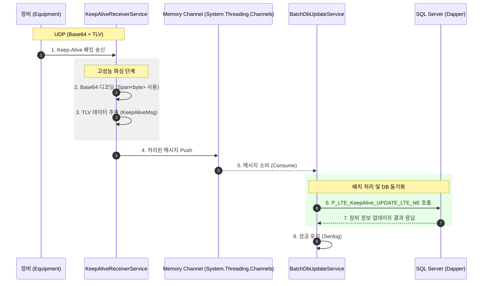
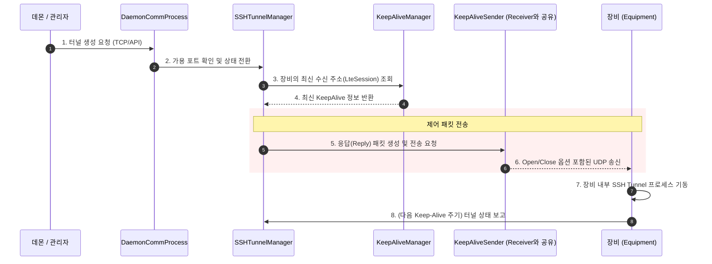

# TACT KeepAlive 서버 통신 흐름도

리팩토링된 .NET 9 시스템의 컴포넌트 간 상세 상호작용 및 통신 흐름입니다.

## 1. Keep-Alive 수신 및 DB 업데이트 흐름

장비(Equipment)로부터 전달된 상태 메시지를 비동기적으로 처리하여 데이터베이스를 최신 상태로 유지하는 주 흐름입니다.

## 2. SSH 터널 제어 흐름 (요청 시)

데몬이나 관리자의 요청에 의해 장비의 SSH 터널을 열거나 닫는 제어 흐름입니다.

## 3. 주요 기술적 특징

- **비동기 큐잉**: 수신부(Receiver)와 처리부(BatchUpdate)를 `Channel`로 분리하여 대량의 패킷 유입 시에도 응답성을 유지합니다.
- **메모리 최적화**: 모든 단계에서 `Span<byte>`를 사용하여 불필요한 복사와 문자열 할당을 방지합니다.
- **배치 DB 작업**: 개별 업데이트 대신 일정한 주기로 DB를 업데이트하여 데이터베이스 서버의 부하를 줄입니다.
